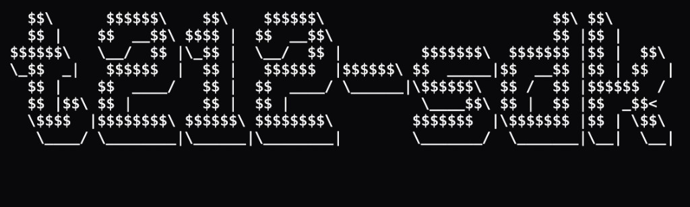

<p align="center">
  
</p>

<p align="center">
  <a href="https://www.npmjs.com/package/t212-sdk"></a>
  <a href="https://www.npmjs.com/package/t212-sdk"></a>
  <a href="https://github.com/codeledge/t212-sdk/blob/main/LICENSE"></a>
  <a href="https://www.typescriptlang.org/"></a>
  <a href="https://nodejs.org/"></a>
</p>

<p align="center">
  <strong>The developer-first way to automate Trading 212.</strong><br>
  Fully typed · Zero runtime deps · Built-in rate limiting · Demo &amp; live ready
</p>

<p align="center">
  <a href="https://www.npmjs.com/package/t212-sdk"><strong>Install on npm</strong></a> ·
  <a href="https://docs.trading212.com/api">Official API docs</a> ·
  <a href="https://github.com/codeledge/t212-sdk/issues">Report an issue</a>
</p>

---

## Why `t212-sdk`?

You shouldn't need to reverse-engineer HTTP quirks, guess response shapes, or babysit rate limits while building a trading bot, portfolio dashboard, or rebalance script.

**`t212-sdk`** wraps the [Trading 212 Public API](https://docs.trading212.com/api) in a clean, typed client so you can focus on strategy — not plumbing.

| | |
|---|---|
| **Fully typed** | Orders, positions, instruments, history — autocomplete everywhere |
| **Zero dependencies** | Native `fetch`. No axios, no bloat. ~15KB bundled |
| **Rate limits handled** | Serial queue + header-aware pacing + auto-retry on `429` |
| **Paper & live** | Flip `environment: "demo"` or `"live"` — same API surface |
| **Pagination built-in** | One page, all pages, or async iterators — your call |
| **ESM + CJS** | Works in Node 18+, Bun, modern bundlers |

```text
  you  ──▶  t212-sdk  ──▶  Trading 212
            auth · queue · types
            JSON ──▶ TypeScript
```

---

## Install

```bash
npm install t212-sdk
# or
pnpm add t212-sdk
# or
yarn add t212-sdk
# or
bun add t212-sdk
```

---

## Quick start

**60 seconds from install to your first API call.**

```typescript
import { T212 } from "t212-sdk";

const client = new T212({
  apiKey: process.env.T212_API_KEY!,
  apiSecret: process.env.T212_API_SECRET!,
  environment: "demo", // paper trading — swap to "live" when ready
});

// Account snapshot
const summary = await client.account.getSummary();
console.log(`Portfolio value: ${summary.totalValue} ${summary.currency}`);

// Place a fractional market order
const order = await client.orders.placeMarket({
  ticker: "AAPL_US_EQ",
  quantity: 0.1,
});
console.log(`Order ${order.id} · ${order.status}`);
```

> **Get API keys:** Trading 212 app → Settings → API (Beta).  
> Supports **Invest** and **Stocks ISA** accounts.

---

## Features at a glance

| | |
|---|---|
| **account** | `getSummary` · `getInfo` · `getCash` |
| **orders** | `list` · `get` · `placeMarket` · `placeLimit` · `placeStop` · `placeStopLimit` · `cancel` |
| **instruments** | `list` · `exchanges` · `findByTicker` |
| **positions** | `list` |
| **history** | paginated + `*All` + async iterators for orders, dividends, transactions |
| **history.exports** | `list` · `request` |

---

## Authentication

Trading 212 uses HTTP Basic auth:

| Option | Role |
|---|---|
| `apiKey` | Username |
| `apiSecret` | Password |
| `environment` | `"demo"` → `demo.trading212.com` · `"live"` → `live.trading212.com` |

Always test in **demo** first. Real money lives on **live**.

---

## Orders

Positive `quantity` = **buy**. Negative = **sell**. Fractional shares supported.

```typescript
// Limit buy — expires end of day
await client.orders.placeLimit({
  ticker: "AAPL_US_EQ",
  quantity: 1,
  limitPrice: 150,
  timeValidity: "DAY",
});

// Stop-loss sell
await client.orders.placeStop({
  ticker: "AAPL_US_EQ",
  quantity: -1,
  stopPrice: 140,
  timeValidity: "GTC",
});

// Cancel
await client.orders.cancel(orderId);
```

---

## Pagination

Historical data is cursor-paginated. Pick your style:

```typescript
// Single page
const page = await client.history.orders({ limit: 50 });

// Every item, all pages
const all = await client.history.ordersAll({ limit: 50 });

// Stream — memory friendly
for await (const { order, fill } of client.history.ordersItems({ limit: 50 })) {
  console.log(order.id, fill?.price);
}
```

---

## Rate limits — we got you

Trading 212 rate-limits per account. **`t212-sdk` handles it for you:**

- Requests run through a serial queue
- Pacing follows `x-ratelimit-*` response headers
- `429` responses trigger wait + automatic retry

You write business logic. The SDK stays out of the way.

```typescript
import { T212Error } from "t212-sdk";

try {
  await client.orders.get(123);
} catch (error) {
  if (error instanceof T212Error && error.isRateLimited) {
    // Rare — SDK retries automatically; this is the escape hatch
  }
}
```

---

## API coverage

| Resource | Methods |
| --- | --- |
| `account` | `getSummary`, `getInfo`, `getCash` |
| `orders` | `list`, `get`, `placeMarket`, `placeLimit`, `placeStop`, `placeStopLimit`, `cancel` |
| `instruments` | `list`, `exchanges`, `findByTicker` |
| `positions` | `list` |
| `history` | `orders`, `ordersAll`, `ordersPages`, `ordersItems`, `dividends`, `dividendsAll`, `dividendsItems`, `transactions`, `transactionsAll`, `transactionsItems` |
| `history.exports` | `list`, `request` |
| `pies` | deprecated Trading 212 endpoints |

---

## Integration tests

Real API tests against the **demo** environment only — `T212_ENVIRONMENT=live` is ignored.

```bash
cp .env.example .env
# T212_API_KEY + T212_API_SECRET from your demo account

npm test
```

| Variable | Required | Default |
|---|---|---|
| `T212_API_KEY` | yes | — |
| `T212_API_SECRET` | yes | — |
| `T212_TEST_TICKER` | no | `AAPL_US_EQ` |

Write tests place a far OTM limit order and cancel it in the same run.

---

## Requirements

- **Node.js 18+** (or any runtime with global `fetch`)
- Trading 212 **Invest** or **Stocks ISA** with API access enabled

---

## Disclaimer

This is an **unofficial** SDK. Not affiliated with Trading 212.  
Trading involves risk. Test thoroughly in demo before going live. You are responsible for your trades.

---

<p align="center">
  <sub>Built with ☕ by <a href="https://github.com/codeledge">codeledge</a> · MIT License</sub>
</p>
